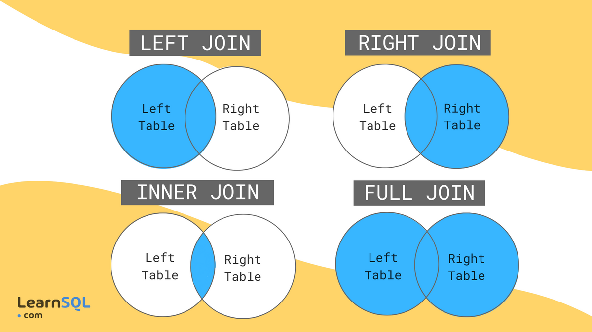

# MySQL Cheat Sheet

> Help with SQL commands to interact with a MySQL database

## Show Databases

```sql
SHOW DATABASES
```

## Create Database

```sql
CREATE DATABASE acme;
```

## Delete Database

```sql
DROP DATABASE acme;
```

## Select Database

```sql
USE acme;
```

## Create Table

```sql
CREATE TABLE users(
   id INT AUTO_INCREMENT,
   first_name VARCHAR(100),
   last_name VARCHAR(100),
   email VARCHAR(50),
   password VARCHAR(20),
   location VARCHAR(100),
   dept VARCHAR(100),
   is_admin TINYINT(1),
   register_date DATETIME,
   PRIMARY KEY(id)
);

or
CREATE TABLE users(
   id INT AUTO_INCREMENT PRIMARY KEY,
   first_name VARCHAR(100) DEFAULT 'first',
   last_name VARCHAR(100),
   email VARCHAR(50) UNIQUE,
   password VARCHAR(20) NOT NULL,
   location VARCHAR(100),
   dept VARCHAR(100),
   is_admin TINYINT(1),
   register_date DATETIME
);
```

## Add New Column

```sql
ALTER TABLE users ADD age VARCHAR(3);
ALTER TABLE users ADD (gpa DECIMAL (3,2), father_name VARCHAR(50) UNIQUE);
```

## Drop Column

```sql
ALTER TABLE users DROP age, DROP gpa;
```

## Modify Definition of Column

```sql
ALTER TABLE users MODIFY age INT(3);
```

## Rename Column

```sql
ALTER TABLE users CHANGE father_name guardian_name VARCHAR(50);
```

## Rename Table

```sql
ALTER TABLE users RENAME TO new_name;
```

## Delete / Drop Table

```sql
DROP TABLE tablename;
```

## Show Tables

```sql
SHOW TABLES;
```

## Insert Row / Record

```sql
INSERT INTO users (
    first_name, last_name, email, password, location, dept, is_admin, register_date
    ) values ('Brad', 'Traversy', 'brad@gmail.com', '123456','Massachusetts', 'development', 1, now());
```

## Insert Multiple Rows

```sql
INSERT INTO users (first_name, last_name, email, password, location, dept, is_admin, register_date)
values('Fred', 'Smith', 'fred@gmail.com', '123456', 'New York', 'design', 0, now()),
('Sara', 'Watson', 'sara@gmail.com', '123456', 'New York', 'design', 0, now()),
('Will', 'Jackson', 'will@yahoo.com', '123456', 'Rhode Island', 'development', 1, now()),
('Paula', 'Johnson', 'paula@yahoo.com', '123456', 'Massachusetts', 'sales', 0, now()),
('Tom', 'Spears', 'tom@yahoo.com', '123456', 'Massachusetts', 'sales', 0, now());
```

## Select

```sql
SELECT * FROM users;
SELECT first_name, last_name FROM users;
```

## Where Clause

> conditions

```bash
field1 = value1
field1 <= value1
field1 >= value1
field1 < value1
field1 > value1
field1 <> value1
field1 LIKE 'value _ %'
field1 IS NULL
field1 IS NOT NULL
field1 IS IN (value1, value2)
field1 IS NOT IN (value1, value2)
condition1 AND condition2
condition1 OR condition2
```

```sql
SELECT * FROM users WHERE location='Massachusetts';
SELECT * FROM users WHERE location='Massachusetts' AND dept='sales';
SELECT * FROM users WHERE is_admin = 1;
SELECT * FROM users WHERE is_admin > 0;
SELECT * FROM users WHERE location IN ('Rhode Island', 'Massachusetts');
```

## Like (Searching)

https://www.geeksforgeeks.org/mysql-regular-expressions-regexp/

```sql

SELECT * FROM users WHERE dept LIKE 'd%';
SELECT * FROM users WHERE dept LIKE 'dev%';
SELECT * FROM users WHERE dept LIKE '%t';
SELECT * FROM users WHERE dept LIKE '%e%';
```

## Not Like

```sql
SELECT * FROM users WHERE dept NOT LIKE 'd%';
```

## IN

```sql
SELECT * FROM users WHERE dept IN ('design', 'sales');
```

## Delete Row

```sql
DELETE FROM users WHERE id = 6;
```

## Update Row

```sql
UPDATE users SET email = 'freddy@gmail.com' WHERE id = 2;
```

## Order By (Sort)

```sql
SELECT * FROM users ORDER BY last_name ASC;
SELECT * FROM users ORDER BY last_name DESC;
SELECT * FROM users ORDER BY first_name asc, last_name DESC;
```

## Limit results

```sql
SELECT * FROM users ORDER BY first_name asc, last_name DESC LIMIT 20;

-- oFFSEt
SELECT * FROM users ORDER BY first_name asc, last_name DESC LIMIT 20 OFFSET 5;

-- or
SELECT * FROM users ORDER BY first_name asc, last_name DESC LIMIT 5, 20;

```

## Select Distinct Rows

```sql
SELECT DISTINCT location FROM users;
SELECT DISTINCT location,first_name FROM users;
```

> either fields are distinct then row will be selected

## Concatenate Columns

```sql
SELECT CONCAT(first_name, ' ', last_name) AS 'Name', dept FROM users;

```

## Between (Select Range)

```sql
SELECT * FROM users WHERE age BETWEEN 20 AND 25;
```

## Create & Remove Index

```sql
CREATE INDEX LIndex On users(location);
DROP INDEX LIndex ON users;
```

## New Table With Foreign Key (Posts)

```sql
CREATE TABLE posts(
id INT AUTO_INCREMENT,
   user_id INT,
   title VARCHAR(100),
   body TEXT,
   publish_date DATETIME DEFAULT CURRENT_TIMESTAMP,
   PRIMARY KEY(id),
   FOREIGN KEY (user_id) REFERENCES users(id)
);
```

## Add Data to Posts Table

```sql
INSERT INTO posts(user_id, title, body) VALUES (1, 'Post One', 'This is post one'),(3, 'Post Two', 'This is post two'),(1, 'Post Three', 'This is post three'),(2, 'Post Four', 'This is post four'),(5, 'Post Five', 'This is post five'),(4, 'Post Six', 'This is post six'),(2, 'Post Seven', 'This is post seven'),(1, 'Post Eight', 'This is post eight'),(3, 'Post Nine', 'This is post none'),(4, 'Post Ten', 'This is post ten');
```

## INNER JOIN

```sql
SELECT
  users.first_name,
  users.last_name,
  posts.title,
  posts.publish_date
FROM users
INNER JOIN posts
ON users.id = posts.user_id
ORDER BY posts.title;
```

## New Table With 2 Foriegn Keys

```sql
CREATE TABLE comments(
	id INT AUTO_INCREMENT,
    post_id INT,
    user_id INT,
    body TEXT,
    publish_date DATETIME DEFAULT CURRENT_TIMESTAMP,
    PRIMARY KEY(id),
    FOREIGN KEY(user_id) references users(id),
    FOREIGN KEY(post_id) references posts(id)
);
```

## Add Data to Comments Table

```sql
INSERT INTO comments(post_id, user_id, body) VALUES (1, 3, 'This is comment one'),(2, 1, 'This is comment two'),(5, 3, 'This is comment three'),(2, 4, 'This is comment four'),(1, 2, 'This is comment five'),(3, 1, 'This is comment six'),(3, 2, 'This is comment six'),(5, 4, 'This is comment seven'),(2, 3, 'This is comment seven');
```

## Left Join

```sql
SELECT
comments.body,
posts.title
FROM comments
LEFT JOIN posts ON posts.id = comments.post_id
ORDER BY posts.title;

```

## Join Multiple Tables

```sql
SELECT
comments.body,
posts.title,
users.first_name,
users.last_name
FROM comments
INNER JOIN posts on posts.id = comments.post_id
INNER JOIN users on users.id = comments.user_id
ORDER BY posts.title;

```

## Aggregate Functions

```sql
SELECT COUNT(id) FROM users;
SELECT COUNT(distinct first_name) FROM users;
SELECT COUNT(location), location FROM users group by location;
SELECT MAX(age) FROM users;
SELECT MIN(age) FROM users;
SELECT avg(id) FROM users;
SELECT SUM(age) FROM users;
SELECT UPPER(first_name), LOWER(last_name) FROM users;
SELECT SUBSTRING(first_name, 1, 4) FROM users;
```

## Group By

```sql
SELECT age, COUNT(age) FROM users GROUP BY age;
SELECT age, COUNT(age) FROM users WHERE age > 20 GROUP BY age;
SELECT age, COUNT(age) FROM users GROUP BY age HAVING count(age) >=2;

```

## If Statements

```sql
SELECT
  id,
  first_name,
  last_name,
  IF(age>=21, 'Old Enough', 'Too Young') AS Age_Status
FROM users;

-- IFNULL
SELECT
  id,
  first_name,
  last_name,
  IFNULL(age, 'No Age') AS Age
FROM users;


```

# EXAMPLE

## COMPANY DB

```sql

CREATE TABLE employee (
  emp_id INT PRIMARY KEY,
  first_name VARCHAR(40),
  last_name VARCHAR(40),
  birth_day DATE,
  sex VARCHAR(1),
  salary INT,
  super_id INT,
  branch_id INT
);

CREATE TABLE branch (
  branch_id INT PRIMARY KEY,
  branch_name VARCHAR(40),
  mgr_id INT,
  mgr_start_date DATE,
  FOREIGN KEY(mgr_id) REFERENCES employee(emp_id) ON DELETE SET NULL
);

ALTER TABLE employee
ADD FOREIGN KEY(branch_id)
REFERENCES branch(branch_id)
ON DELETE SET NULL;

ALTER TABLE employee
ADD FOREIGN KEY(super_id)
REFERENCES employee(emp_id)
ON DELETE SET NULL;

CREATE TABLE client (
  client_id INT PRIMARY KEY,
  client_name VARCHAR(40),
  branch_id INT,
  FOREIGN KEY(branch_id) REFERENCES branch(branch_id) ON DELETE SET NULL
);

CREATE TABLE works_with (
  emp_id INT,
  client_id INT,
  total_sales INT,
  PRIMARY KEY(emp_id, client_id),
  FOREIGN KEY(emp_id) REFERENCES employee(emp_id) ON DELETE CASCADE,
  FOREIGN KEY(client_id) REFERENCES client(client_id) ON DELETE CASCADE
);

CREATE TABLE branch_supplier (
  branch_id INT,
  supplier_name VARCHAR(40),
  supply_type VARCHAR(40),
  PRIMARY KEY(branch_id, supplier_name),
  FOREIGN KEY(branch_id) REFERENCES branch(branch_id) ON DELETE CASCADE
);


-- -----------------------------------------------------------------------------

-- Corporate
INSERT INTO employee VALUES(100, 'David', 'Wallace', '1967-11-17', 'M', 250000, NULL, NULL);

INSERT INTO branch VALUES(1, 'Corporate', 100, '2006-02-09');

UPDATE employee
SET branch_id = 1
WHERE emp_id = 100;

INSERT INTO employee VALUES(101, 'Jan', 'Levinson', '1961-05-11', 'F', 110000, 100, 1);

-- Scranton
INSERT INTO employee VALUES(102, 'Michael', 'Scott', '1964-03-15', 'M', 75000, 100, NULL);

INSERT INTO branch VALUES(2, 'Scranton', 102, '1992-04-06');

UPDATE employee
SET branch_id = 2
WHERE emp_id = 102;

INSERT INTO employee VALUES(103, 'Angela', 'Martin', '1971-06-25', 'F', 63000, 102, 2);
INSERT INTO employee VALUES(104, 'Kelly', 'Kapoor', '1980-02-05', 'F', 55000, 102, 2);
INSERT INTO employee VALUES(105, 'Stanley', 'Hudson', '1958-02-19', 'M', 69000, 102, 2);

-- Stamford
INSERT INTO employee VALUES(106, 'Josh', 'Porter', '1969-09-05', 'M', 78000, 100, NULL);

INSERT INTO branch VALUES(3, 'Stamford', 106, '1998-02-13');

UPDATE employee
SET branch_id = 3
WHERE emp_id = 106;

INSERT INTO employee VALUES(107, 'Andy', 'Bernard', '1973-07-22', 'M', 65000, 106, 3);
INSERT INTO employee VALUES(108, 'Jim', 'Halpert', '1978-10-01', 'M', 71000, 106, 3);


-- BRANCH SUPPLIER
INSERT INTO branch_supplier VALUES(2, 'Hammer Mill', 'Paper');
INSERT INTO branch_supplier VALUES(2, 'Uni-ball', 'Writing Utensils');
INSERT INTO branch_supplier VALUES(3, 'Patriot Paper', 'Paper');
INSERT INTO branch_supplier VALUES(2, 'J.T. Forms & Labels', 'Custom Forms');
INSERT INTO branch_supplier VALUES(3, 'Uni-ball', 'Writing Utensils');
INSERT INTO branch_supplier VALUES(3, 'Hammer Mill', 'Paper');
INSERT INTO branch_supplier VALUES(3, 'Stamford Lables', 'Custom Forms');

-- CLIENT
INSERT INTO client VALUES(400, 'Dunmore Highschool', 2);
INSERT INTO client VALUES(401, 'Lackawana Country', 2);
INSERT INTO client VALUES(402, 'FedEx', 3);
INSERT INTO client VALUES(403, 'John Daly Law, LLC', 3);
INSERT INTO client VALUES(404, 'Scranton Whitepages', 2);
INSERT INTO client VALUES(405, 'Times Newspaper', 3);
INSERT INTO client VALUES(406, 'FedEx', 2);

-- WORKS_WITH
INSERT INTO works_with VALUES(105, 400, 55000);
INSERT INTO works_with VALUES(102, 401, 267000);
INSERT INTO works_with VALUES(108, 402, 22500);
INSERT INTO works_with VALUES(107, 403, 5000);
INSERT INTO works_with VALUES(108, 403, 12000);
INSERT INTO works_with VALUES(105, 404, 33000);
INSERT INTO works_with VALUES(107, 405, 26000);
INSERT INTO works_with VALUES(102, 406, 15000);
INSERT INTO works_with VALUES(105, 406, 130000);

```

## BASIC QUERIES

```sql

-- Find all employees
SELECT *
FROM employee;

-- Find all clients
SELECT *
FROM clients;

-- Find all employees ordered by salary
SELECT *
from employee
ORDER BY salary ASC/DESC;

-- Find all employees ordered by sex then name
SELECT *
from employee
ORDER BY sex, name;

-- Find the first 5 employees in the table
SELECT *
from employee
LIMIT 5;

-- Find the first and last names of all employees
SELECT first_name, employee.last_name
FROM employee;

-- Find the forename and surnames names of all employees
SELECT first_name AS forename, employee.last_name AS surname
FROM employee;

-- Find out all the different genders
SELECT DISCINCT sex
FROM employee;

-- Find all male employees
SELECT *
FROM employee
WHERE sex = 'M';

-- Find all employees at branch 2
SELECT *
FROM employee
WHERE branch_id = 2;

-- Find all employee's id's and names who were born after 1969
SELECT emp_id, first_name, last_name
FROM employee
WHERE birth_day >= 1970-01-01;

-- Find all female employees at branch 2
SELECT *
FROM employee
WHERE branch_id = 2 AND sex = 'F';

-- Find all employees who are female & born after 1969 or who make over 80000
SELECT *
FROM employee
WHERE (birth_day >= '1970-01-01' AND sex = 'F') OR salary > 80000;

-- Find all employees born between 1970 and 1975
SELECT *
FROM employee
WHERE birth_day BETWEEN '1970-01-01' AND '1975-01-01';

-- Find all employees named Jim, Michael, Johnny or David
SELECT *
FROM employee
WHERE first_name IN ('Jim', 'Michael', 'Johnny', 'David');
```

## FUNCTIONS

```sql

-- Find the number of employees
SELECT COUNT(super_id)
FROM employee;

-- Find the average of all employee's salaries
SELECT AVG(salary)
FROM employee;

-- Find the sum of all employee's salaries
SELECT SUM(salary)
FROM employee;

-- Find out how many males and females there are
SELECT COUNT(sex), sex
FROM employee
GROUP BY sex

-- Find the total sales of each salesman
SELECT SUM(total_sales), emp_id
FROM works_with
GROUP BY client_id;

-- Find the total amount of money spent by each client
SELECT SUM(total_sales), client_id
FROM works_with
GROUP BY client_id;
```

## WILDCARDS

```sql

-- % = any number of characters, _ = one character

-- Find any client's who are an LLC
SELECT *
FROM client
WHERE client_name LIKE '%LLC';

-- Find any branch suppliers who are in the label business
SELECT *
FROM branch_supplier
WHERE supplier_name LIKE '% Label%';

-- Find any employee born on the 10th day of the month
SELECT *
FROM employee
WHERE birth_day LIKE '_____10%';

-- Find any clients who are schools
SELECT *
FROM client
WHERE client_name LIKE '%Highschool%';
```

## UNIONS

```sql
-- Find a list of employee and branch names
SELECT employee.first_name AS Employee_Branch_Names
FROM employee
UNION
SELECT branch.branch_name
FROM branch;

-- Find a list of all clients & branch suppliers' names
SELECT client.client_name AS Non_Employee_Entities, client.branch_id AS Branch_ID
FROM client
UNION
SELECT branch_supplier.supplier_name, branch_supplier.branch_id
FROM branch_supplier;
```

## JOINS



```sql
-- inner join
SELECT employee.emp_id, employee.first_name, branch.branch_name
FROM employee
JOIN branch
ON employee.emp_id = branch.mgr_id;

-- left and right join
SELECT employee.emp_id, employee.first_name, branch.branch_name
FROM employee
LEFT JOIN branch    -- RIGHT JOIN
ON employee.emp_id = branch.mgr_id;

-- full outer join
SELECT employee.emp_id, employee.first_name, branch.branch_name
FROM employee
LEFT JOIN branch
ON employee.emp_id = branch.mgr_id
union
SELECT employee.emp_id, employee.first_name, branch.branch_name
FROM employee
right JOIN branch
ON employee.emp_id = branch.mgr_id;

```

## nested query

```sql

-- Find names of all employees who have sold over 50,000
SELECT employee.first_name, employee.last_name
FROM employee
WHERE employee.emp_id IN (SELECT works_with.emp_id
                          FROM works_with
                          WHERE works_with.total_sales > 50000);

-- Find all clients who are handles by the branch that Michael Scott manages
-- Assume you know Michael's ID
SELECT client.client_id, client.client_name
FROM client
WHERE client.branch_id = (SELECT branch.branch_id
                          FROM branch
                          WHERE branch.mgr_id = 102);

 -- Find all clients who are handles by the branch that Michael Scott manages
 -- Assume you DONT'T know Michael's ID
 SELECT client.client_id, client.client_name
 FROM client
 WHERE client.branch_id = (SELECT branch.branch_id
                           FROM branch
                           WHERE branch.mgr_id = (SELECT employee.emp_id
                                                  FROM employee
                                                  WHERE employee.first_name = 'Michael' AND employee.last_name ='Scott'
                                                  LIMIT 1));


-- Find the names of employees who work with clients handled by the scranton branch
SELECT employee.first_name, employee.last_name
FROM employee
WHERE employee.emp_id IN(SELECT works_with.emp_id FROM works_with)AND employee.branch_id=2;

-- Find the names of all clients who have spent more than 100,000 dollars
SELECT client.client_name
FROM client
WHERE client.client_id IN(SELECT client_id
                          FROM(SELECT SUM(works_with.total_sales) AS totals, client_id
                               FROM works_with
                               GROUP BY client_id) AS total_client_sales
                          WHERE totals>100000);
```
